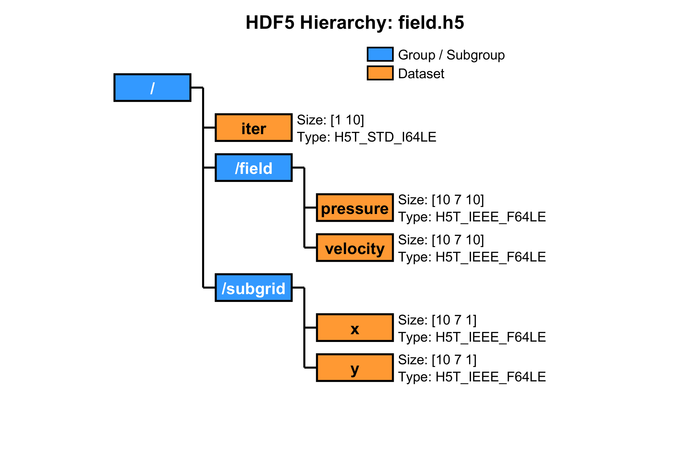
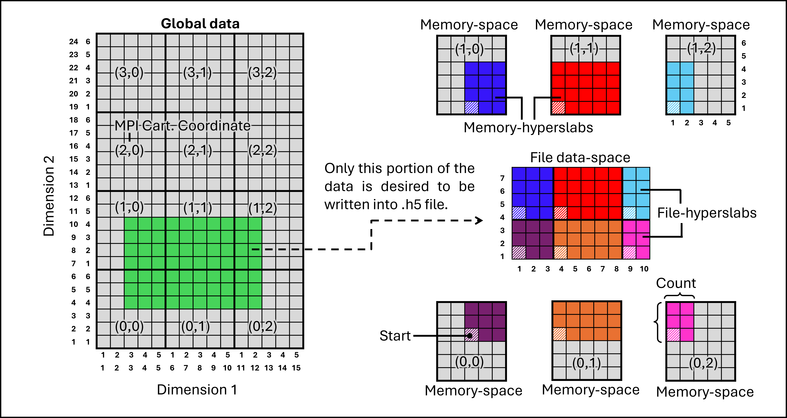

# Fortran Wrapper for HDF5
This is a Fortran wrapper for writing data into .h5 file, which is particularly created for CFD.
The module is created in a modular format with a derived type *h5_dataset_type*, dedicated to open h5 files, define datasets, data spaces, hyperslabs, managing its own objects, and closing all h5 resources at the end. This wrapper is helpful in simplifying and reducing the write commands in the main file, however, the logic for defining the hyperslabs for file as well as memory is user dependent. 

## Description of the files
**mod_h5_utility.F90**\
The file contains a module mod_h5_utility, serving as a wrapper, which can be directly used in any Fortran code.

**main.F90**\
Various example files are provided under example folders main_file*/. One example for serial mode is provided, however, the parallel mode examples can also be executed in serial mode with necessary changes in the main file and job submission file.

**makefile**\
This file can be used to compile the code.

**job_submit_parallel.sh**\
In each example folder for parallel mode, SLURM job submission file is provided.

**reading_h5_data.m**\
This is an example Matlab file to read .h5 file data.

## Steps to compile and run an example
1. Copy mod_h5_utility.F90 to a directory, say test_dir/.
2. Copy any main.F90 and corresponding job_submit_parallel.sh files to test_dir/.
3. Copy makefile to the same directory.
4. In cluster, first load modules as described in the makefile. For example,\
   module load gnu openmpi
5. If particular versions of the modules are used while compiling, update the modules in job_submit_parallel.sh.
6. To compile, type: make
7. To clean directory, type: make clean
8. To submit job through SLURM, type: sbatch \<name of the executable\>.

## Output files
**.h5 files**  : As defined in the main.F90 files.

**.txt files** : output and error files as defined in job_submit_parallel.sh.

## Points to take care
1. Object with *h5_dataset_type* type can have multiple datasets under a common **file, file space & hyperslab, memory space & hyperslab, group, and plist (property list)**. Another object will be required if a dataset uses another file data space or memory space (input variable's size and its hyperslab). 
2. File_id is automatically copied if it is created under the same file to avoid opening multiple file handles.
3. With two different MPI communicators (having different set of ranks), the same file can not be opened.
4. With restart option, restart index is required from where the date is resumed to be written. Note that the data is written exactly from the restart index. Therefore the data corresponding to that iteration has to be written first before proceeding with further computation.

## Example of HDF5 hierarchy
The following graph is based on the example under main_file_parallel_04/.

  

The following figure explains the terms used in HDF5, such as file data-space, memory-space, file-hyperslab, and memory-hyperslab. The data-spaces only contain the meta-data such as size of the array, data-type, and the information of the associated hyperslab. Hyperslab is defined by the start index and the count in each direction. In the following illustration, each of the smallest boxes represents an element of an array.

  

